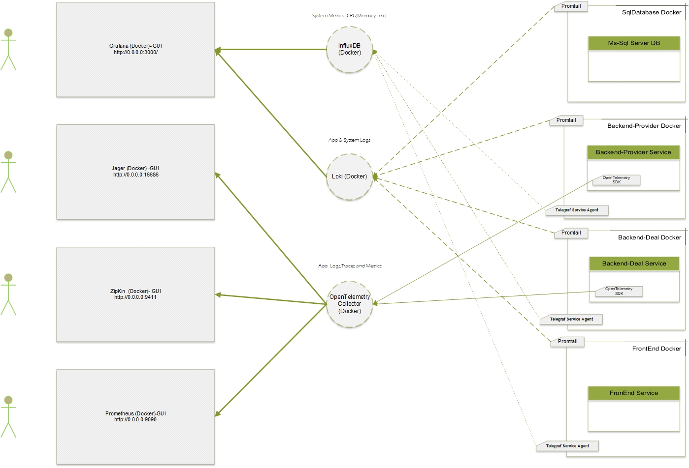

# FH-Msc-Microservice-Monitoring

> Discover a cutting-edge Microservice Cloud Native Project that leverages the power of .NET Core 6.0 for its backend, and Vue 3.0 for a sleek and intuitive frontend. This innovative application is designed with cloud-native principles in mind, ensuring scalability, resilience, and agility. It's the perfect choice for modern, dynamic environments. 

What makes this project stand out? It harnesses the potential of the OpenTelemetry NuGet library, providing seamless instrumentation and the capability to send telemetry data to the OpenTelemetry Collector. This means you can easily monitor and optimize your application's performance, ensuring that it runs like a well-oiled machine.

Join us on this exciting journey towards a cloud-native future, where your project scales effortlessly, adapts to changing needs, and takes advantage of the latest technologies. Welcome to the future of Microservice Cloud Native Development!

#### The demo exposes the following backends:

### App   

    Frontend at http://localhost:8080/
    Backend Provider API at http://localhost:8081/
    Backend Deal API at http://localhost:8082/

  

### Monitor Tools
    Grafana Tools:
    Grafana at  http://0.0.0.0:3000/
    LOKI at http://0.0.0.0:3100/status
    InfluxDB at : http://0.0.0.0:8086/

    OpenTelemtry Tools :
    Jaeger at http://0.0.0.0:16686
    Zipkin at http://0.0.0.0:9411
    Prometheus at http://0.0.0.0:9090

### Run the demo local

> docker plugin install grafana/loki-docker-driver:latest --alias loki --grant-all-permissions

> git clone https://github.com/waelamer/FH-Msc-Microservice-Monitoring.git && cd FH-Msc-Microservice-Monitoring && docker-compose up -d --force-recreate 

